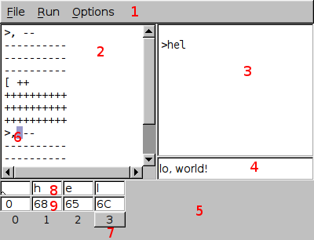

BF IDE
======

Operation
---------

### BF language & interpreter
 
* `+` Increment the current cell modulo 256.
* `-`  Decrement the current cell modulo 256.
* `<`  Shift left on the tape.
* `>`  Shift right on tape.
* `,`  Read one character of input, and write its ASCII value to the current cell.
* `.`  Write ASCII representation of current cell`s value to output.
* `[`  If current cell value is 0, continue executing after next `]`. Otherwise, continue executing.
* `]`  Terminate loop begun by `[`.

At cell index 0, `<` is an invalid command. `[` and `]` must be matched.

The IDE additionally supports breakpoints, indicated by `$`.

### bfide

Runs, steps, and examines the state of a BF program.

1. BF program
2. I/O console: input is prefixed with `>`. Errors, if any will also appear here.
3. Tape: each cell, from top to bottom, has the ASCII and hexadecimal representations of its value, and then the cell index.
4. Execution pointer: the next command to be executed. Highlights the following newline if at EOF.
5. Tape pointer: Shows the current cell of the tape.
6. Run/continue: If at EOF, reset the program and begin running until EOF or a breakpoint. If already executing, but stopped, continue executing until EOF or a breakpoint.
7. Step forward: If at EOF, reset the program. Otherwise, execute the next instruction.
8. Step backward: Not implemented yet.
9. Input field: Program input is taken from here. Input is consumed as it is used; only used input gets written to the I/O console.
10. Prompt: Determines execution behavior when the input field is blank, but the program needs more input. If User, focus goes to the input box, and execution stops until the user adds input. If Null, all inputs are nonblocking, and input commands when the input field is empty write the null character.

### clint <filename>

A simple interpreter. `clint` requires one argument, the filename of the BF script. It can be used as a shebang. `,` blocks until input is available on stdin, output is to stdout, and error messages are on stderr. Unrecognized commands are ignored.

Installation
------------

### Linux

1. Install [fltk 1.3](https://www.fltk.org/software.php).

2. Compile. 

        cd /path/to/brainfide/
        make

4. Run.

        make run # compile & run IDE
        ./bfide # IDE
        ./clint filename.bf # CL interpreter, uses stdin and stdout

### MinGW-w64

1. Make sure you have fltk's build dependencies.

        pacman -S mingw-w64-x86_64-gcc mingw-w64-x86_64-cmake mingw-w64-x86_64-make

2. Install [fltk 1.3](https://www.fltk.org/software.php).

        wget https://fltk.org/path/to/source.tar.gz
        tar xzf fltk-source-tarball.tar.gz
        cd fltk-source-folder
        mkdir build
        cd build
        cmake -G "MinGW Makefiles" -D CMAKE_MAKE_PROGRAM=mingw32-make ..
        mingw32-make

3. Compile.

        cd /path/to/brainfide/
        FLTKCONFIG='/path/to/fltk-source/build/fltk-config' mingw32-make -e

4. Run.

        mingw32-make run # compile & run IDE
        ./bfide # IDE
        ./clint filename.bf # CL interpreter, uses stdin and stdout

### Other platforms

Untested. Presumably works on MacOS.

*This project is based in part on the work of the FLTK project (http://www.fltk.org).*